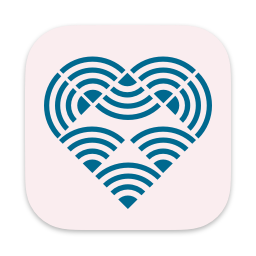

<h1>Operating systems</h1>
<nav>
	<ul>
		<li class="android"><a href="#android" class="ostab android">Android</a>
		<li class="apple"><a href="#apple" class="ostab apple">Apple</a>
		<li class="linux"><a href="#linux" class="ostab linux">Linux</a>
		<li class="windows"><a href="#windows" class="ostab windows">Windows</a>
	</ul>
</nav>

<section class="highlight default">

Select your operating system from the list

</section>

<section class="highlight os" id="android">
<h2>Android</h2>

<h3 class="landing-title">geteduroam
	
	<small>Easily connect your devices to eduroam, download the app to get started</small></h3>

<ul class="download-buttons">
	<li></li>
	<li></li>
</ul>

</section>

<section class="highlight os" id="apple">
<h2>Apple</h2>

<h3 class="landing-title">geteduroam
	
	<small>Easily connect your devices to eduroam, download the app to get started</small></h3>

<ul class="download-buttons">
<li>
</ul>

</section>

<section class="highlight os" id="linux">
<h2>Linux</h2>

<h3 class="landing-title">geteduroam
	
	<small>Easily connect your devices to eduroam, download the app to get started</small></h3>

<ul class="download-buttons">
<li>
</ul>

</section>

<section class="highlight os" id="windows">
<h2>Windows</h2>

<h3 class="landing-title">geteduroam
	
	<small>Easily connect your devices to eduroam, download the app to get started</small></h3>

<ul class="download-buttons">
<li>

Windows

	<ul>
		<li><a href="https://dl.eduroam.app/windows/amd64/geteduroam.exe">Intel/AMD</a>
		<li><a href="https://dl.eduroam.app/windows/arm64/geteduroam.exe">ARM</a>
		<li><a href="https://github.com/geteduroam/windows-app/releases">⎋ GitHub</a>
	</ul>

</ul>

</section>

---
